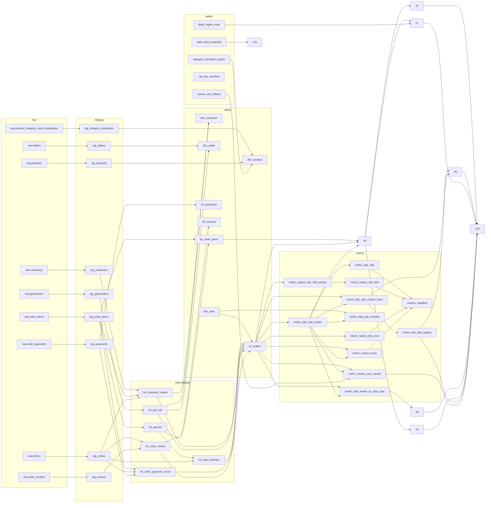

# Lineage

Generated by `make docs` from `target/manifest.json`. For the interactive graph run `make docs && .venv/bin/dbt docs serve`.

```mermaid
flowchart LR
  subgraph raw
    n48[raw.customers]
    n49[raw.geolocation]
    n50[raw.order_items]
    n51[raw.order_payments]
    n52[raw.order_reviews]
    n53[raw.orders]
    n56[raw.product_category_name_translation]
    n54[raw.products]
    n55[raw.sellers]
  end
  subgraph seeds
    n43[category_translation_patch]
    n44[dash_region_map]
    n45[dash_tests_example]
    n46[raw_file_manifest]
    n47[review_cost_effects]
  end
  subgraph staging
    n34[stg_category_translation]
    n35[stg_customers]
    n36[stg_geolocation]
    n37[stg_order_items]
    n38[stg_orders]
    n39[stg_payments]
    n40[stg_products]
    n41[stg_reviews]
    n42[stg_sellers]
  end
  subgraph intermediate
    n16[int_customer_orders]
    n17[int_geo_zip]
    n18[int_order_delivery]
    n19[int_order_payment_recon]
    n20[int_order_review]
    n21[int_parcels]
  end
  subgraph marts
    n1[dim_customer]
    n2[dim_date]
    n3[dim_product]
    n4[dim_seller]
    n12[fct_order_items]
    n13[fct_orders]
    n14[fct_payments]
    n15[fct_reviews]
  end
  subgraph metrics
    n22[metric_bad_review_by_days_late]
    n23[metric_late_rate]
    n24[metric_late_rate_control_chart]
    n25[metric_late_rate_monthly]
    n26[metric_late_rate_orders]
    n27[metric_late_rate_targets]
    n28[metric_repeat_rate_90d]
    n29[metric_repeat_rate_90d_people]
    n30[metric_repeat_rate_ever]
    n31[metric_review_cost_causal]
    n32[metric_review_score]
    n33[metrics_headline]
  end
  n0 --> n5
  n0 --> n7
  n0 --> n9
  n2 --> n13
  n2 --> n25
  n5 --> n10
  n6 --> n10
  n7 --> n10
  n8 --> n10
  n9 --> n10
  n12 --> n0
  n13 --> n0
  n13 --> n22
  n13 --> n24
  n13 --> n26
  n13 --> n29
  n13 --> n30
  n13 --> n31
  n13 --> n32
  n16 --> n1
  n16 --> n13
  n17 --> n1
  n17 --> n4
  n17 --> n13
  n18 --> n13
  n19 --> n13
  n20 --> n13
  n20 --> n15
  n21 --> n12
  n21 --> n18
  n22 --> n8
  n23 --> n33
  n24 --> n6
  n24 --> n27
  n26 --> n0
  n26 --> n22
  n26 --> n23
  n26 --> n24
  n26 --> n25
  n26 --> n31
  n26 --> n32
  n27 --> n6
  n27 --> n10
  n28 --> n33
  n29 --> n28
  n30 --> n33
  n31 --> n10
  n32 --> n33
  n34 --> n3
  n35 --> n16
  n36 --> n17
  n37 --> n12
  n37 --> n16
  n37 --> n19
  n37 --> n21
  n38 --> n16
  n38 --> n18
  n38 --> n19
  n38 --> n20
  n39 --> n14
  n39 --> n19
  n40 --> n3
  n41 --> n20
  n42 --> n4
  n43 --> n3
  n44 --> n7
  n45 --> n11
  n47 --> n31
  n48 --> n35
  n49 --> n36
  n50 --> n37
  n51 --> n39
  n52 --> n41
  n53 --> n38
  n54 --> n40
  n55 --> n42
  n56 --> n34
```
